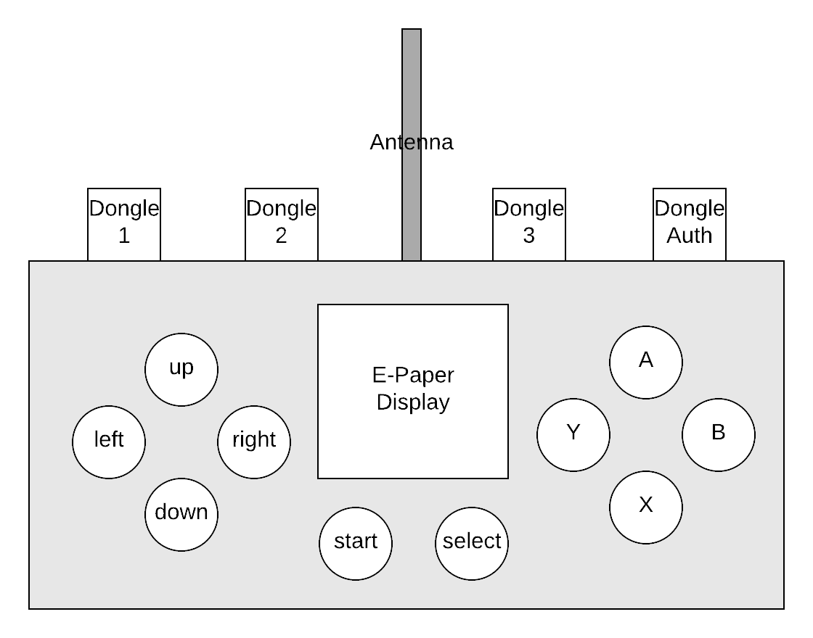
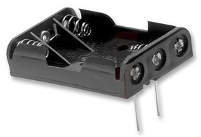

# Controller

The controller could be build like shown in the sketch below.

## Capacitive Touch

The controller should be build without any hardware, like mechanical buttons, for the controls. This van be achieved by using capacitive touch. This way, you don't need any physical hardware, (many buttons are way to small to interface directly and are uncomfortable). Capacitive touch pads only require some space on a PCB.

An example can be found on the [Touchberry Pi controller](https://circuitmaker.com/Projects/Details/Sille-Van-Landschoot-2/TouchBerry-Pi). All the schematics and PCB designs of this controller are open source and can be found at [circuitmaker.com ](https://circuitmaker.com/Projects/Details/Sille-Van-Landschoot-2/TouchBerry-Pi).

The Touchberry Pi shield can even be used for prototyping. No extra hardware is required as it uses a simple QT1070 chip that you can interface using I²C. More information can be found in the [datasheet](https://ww1.microchip.com/downloads/en/DeviceDoc/Atmel-9596-AT42-QTouch-BSW-AT42QT1070_Datasheet.pdf).

One thing to remember is that the QT1070 does not support multitouch. This will need to be considered in the design of your controller. None the less this won't prevent you to do some cool stuff with the Touchberry controller.

Note: The STM32 microcontroller supports capacitive touch out of the box as well. At the moment, no proof of concept or examples are available. It will need some work and datasheet diving to get it working on Mbed. Maybe not easy but definitely possible.

## LoRaWAN communication

To make a controller wireless, it needs to be equipped with a wireless technologie. Wifi is not low-power enough, and Bluetooth needs an extra receiver close by. LoRaWAN is low power and does not necessarily need any receiver close by. It makes for a great technology to make the controller wireless.

LoRaWAN does have some limitation, but this does not mean it will prevent us from doing some cool stuff with it. This project will prove certainly prove that.

## Smart Dongles

The controller needs be made extensible. This can be achieved by adding some expansion slots (3 or 4) for dongles (addon cards). The dongles are provisioned with a small EEPROM chip that contains data or and identifier. Using I²C, the dongles can be read at startup and unlock functionality.

One of the dongles will need to be used to identify yourself to the controller. This way, anyone could get a personal dongle (as a keychain for example). If you would like to play with any controller you just need to insert your personal dongle, and the game knows who you are.

Some dongles could have some LED's on them to display status. Or maybe , another capacitive touch button can be added to add some extra features?

### Choose your weapons !

The dongles could have specific functions. Some dongles could act as weapons, other will help you defend or will give an energy boost. Some examples might be:

* Weapons
  * Flammenwerpfers
  * Lasers
  * Mines
  * Plasma guns
  * EMP bombs
* Defence
  * Shields
  * Turrets
* Boosters
  * Ram
  * Range extender
  * Airlifts
  * Harriers

Depending on the dongles you insert in your controller you could make your personal tank/bot.

## E-paper display

In the center, an E-Paper display could be placed to give feedback to the user. It may be used to display different kinds of information:

* your hit points (health)
* types of addons (dongles)
* battery status
* the name of the authenticated player
* bullets fired / bullets left
* energy level

## Battery powered

