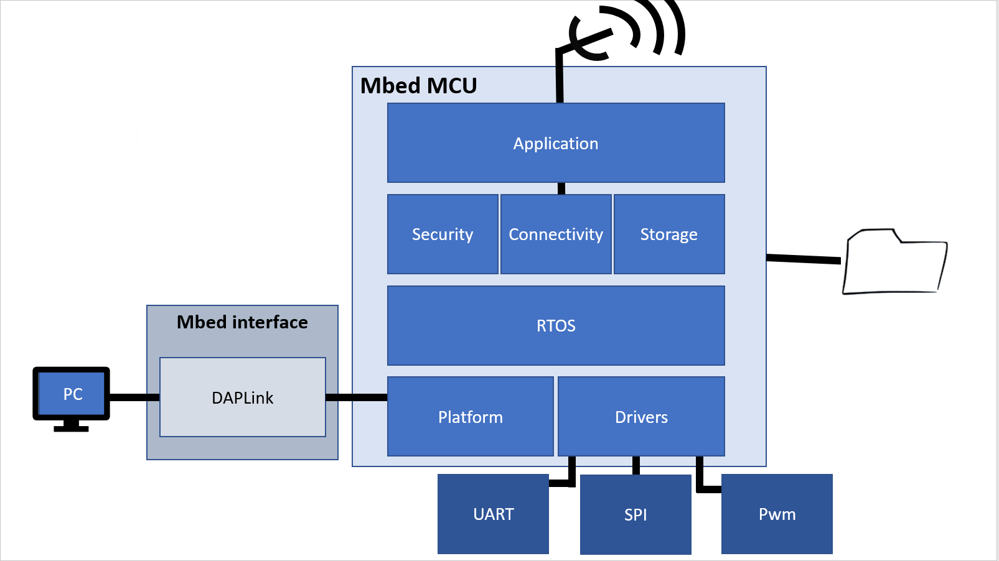

# Firmware requirements

The non-limited list of tasks of the firmware designers consists of the:

* development of the **Mbed device drivers**;
* integration of the Mbed firmware in **Mbed OS**;
* communication with the software development team using the Agile **SCRUM** Software Development Methodology.

## Mbed device drivers

The Mbed device drivers should be developed according to the Object Oriented Paradigm \(OOP\), for instance in C++. As a good software developer you should create abstractions for all hardware. For each device that will be interfaced by the Mbed, the driver software should be based on at least one **class**. A recommended approach is to divide the software in at least three sections: the **interface** \(e.g. GPSmodule.h\), the **implementation **\(e.g. GPSmodule.cpp\) and **application** \(e.g. GPStest.cpp\) \(see **image below**\).

## Integration of the Mbed firmware in Mbed OS

ARM Mbed OS is an open source embedded operating system designed specifically for the "things" in the Internet of Things \(see **image below**\). It includes all the features you need to develop a connected product based on an ARM Cortex-M microcontroller, including security, connectivity, an RTOS (Real-Time Operating System) and drivers for sensors and I/O devices.

More info about Mbed OS can be found at [https://os.mbed.com/](https://os.mbed.com/).

## Version control with git and GitHub

All firmware code should be managed with git and GitHub. Manage the code projects in a repository on [https://github.com/vives-projectwerk2-2019](https://github.com/vives-projectwerk2-2019).