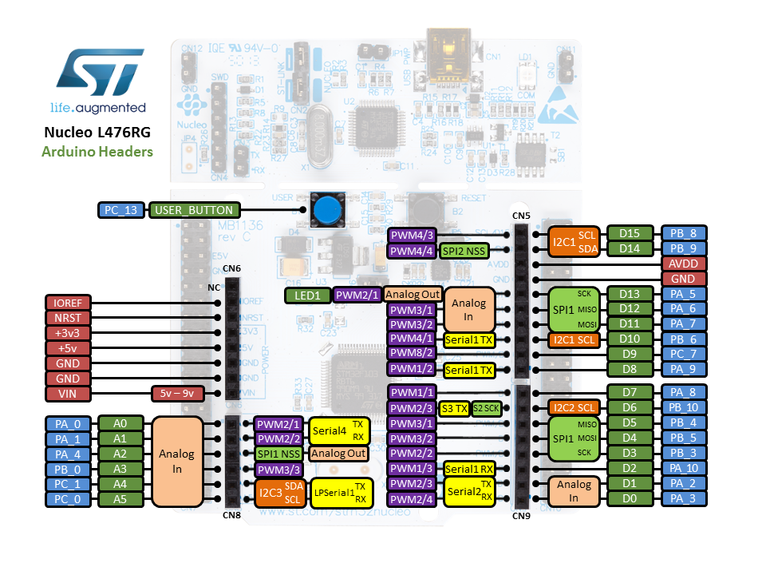

# Hardware requirements

The non-limited list of tasks of the hardware designers consists of the:

* development of a prototype using a processor and sensor boards;
* development of a custom battery powered PCB;

## Prototype

In an early stage, a fast proof-of-concept must be build using a prototype design. This design can be build using existing processor boards, breakout sensor boards and other pre-made hardware. This design will serve as a platform to test and develop firmware. In the next stage, a custom PCB with all the components must be build.

### Nucleo L476RG

The STM32 Nucleo board provides an affordable and flexible way for users to try out new ideas and build prototypes with any STM32 microcontroller line, choosing from the various combinations of performance, power consumption and features.

The Arduino™ connectivity support and ST Morpho headers make it easy to expand the functionality of the STM32 Nucleo open development platform with a wide choice of specialized shields.

The STM32 Nucleo board does not require any separate probe as it integrates the ST-LINK/V2-1 debugger/programmer.

#### Microcontroller features

The STM32L476RG SoC provides the following hardware IPs:

* Ultra-low-power with FlexPowerControl (down to 130 nA Standby mode and 100 uA/MHz run mode)
* Core: ARM® 32-bit Cortex®-M4 CPU with FPU, frequency up to 80 MHz, 100DMIPS/1.25DMIPS/MHz (Dhrystone 2.1)
* Clock Sources:
  * 4 to 48 MHz crystal oscillator
  * 32 kHz crystal oscillator for RTC (LSE)
  * Internal 16 MHz factory-trimmed RC ( ±1%)
  * Internal low-power 32 kHz RC ( ±5%)
  * Internal multispeed 100 kHz to 48 MHz oscillator, auto-trimmed by LSE (better than ±0.25 % accuracy)
  * 3 PLLs for system clock, USB, audio, ADC
* RTC with HW calendar, alarms and calibration
* LCD 8 x 40 or 4 x 44 with step-up converter
* Up to 24 capacitive sensing channels: support touchkey, linear and rotary touch sensors
* 16x timers:
  * 2x 16-bit advanced motor-control
  * 2x 32-bit and 5x 16-bit general purpose
  * 2x 16-bit basic
  * 2x low-power 16-bit timers (available in Stop mode)
  * 2x watchdogs
  * SysTick timer
* Up to 114 fast I/Os, most 5 V-tolerant, up to 14 I/Os with independent supply down to 1.08 V
* Memories
  * Up to 1 MB Flash, 2 banks read-while-write, proprietary code readout protection
  * Up to 128 KB of SRAM including 32 KB with hardware parity check
  * External memory interface for static memories supporting SRAM, PSRAM, NOR and NAND memories
  * Quad SPI memory interface
* 4x digital filters for sigma delta modulator
* Rich analog peripherals (independent supply)
  * 3x 12-bit ADC 5 MSPS, up to 16-bit with hardware oversampling, 200 uA/MSPS
  * 2x 12-bit DAC, low-power sample and hold
  * 2x operational amplifiers with built-in PGA
  * 2x ultra-low-power comparators
* 18x communication interfaces
  * USB OTG 2.0 full-speed, LPM and BCD
  * 2x SAIs (serial audio interface)
  * 3x I2C FM+(1 Mbit/s), SMBus/PMBus
  * 6x USARTs (ISO 7816, LIN, IrDA, modem)
  * 3x SPIs (4x SPIs with the Quad SPI)
  * CAN (2.0B Active) and SDMMC interface
  * SWPMI single wire protocol master I/F
* 14-channel DMA controller
* True random number generator
* CRC calculation unit, 96-bit unique ID
* Development support: serial wire debug (SWD), JTAG, Embedded Trace Macrocell™

#### Nucleo features

* Two types of extension resources
  * Arduino Uno Revision 3 connectivity
  * STMicroelectronics Morpho extension pin headers for full access to all STM32 I/Os
* On-board ST-LINK/V2-1 debugger/programmer with SWD connector
  * Selection-mode switch to use the kit as a standalone ST-LINK/V2-1
* Flexible board power supply
  * USB VBUS or external source (3.3 V, 5 V, 7 - 12 V)
* Power management access point
* User LED (LD2)
* Two push buttons: USER and RESET
* USB re-enumeration capability: three different interfaces supported on USB
  * Virtual Com port
  * Mass storage (USB Disk drive) for drag'n'drop programming
  * Debug port

#### Nucleo pinout

##### Arduino headers

##### Morpho headers

### More information:

 * Official ST website: https://www.st.com/en/evaluation-tools/nucleo-l476rg.html
 * mbed OS: https://os.mbed.com/platforms/ST-Nucleo-L476RG/

The Nucleo platform with the L476RG is the ideal prototyping platform. It is fully supported by mbed (mbed OS and mbed CLI), its a powerful processors that enables us to experiment without many limitations. The STM32-L476 is also able to run in very low power modes.

## Custom PCB

In the next stage, a custom PCB must be build using only the essential components. The PCB must also make use of battery power to operate, and must be optimized to run as long as possible. PCB's can be ordered online using a service like http://www.allpcb.com/ or an alternative service.

The PCB can be designed using the design software of your preference. We recommend [CircuitMaker](https://circuitmaker.com/), but [Eagle](https://www.autodesk.com/products/eagle/overview) is also a good option.

